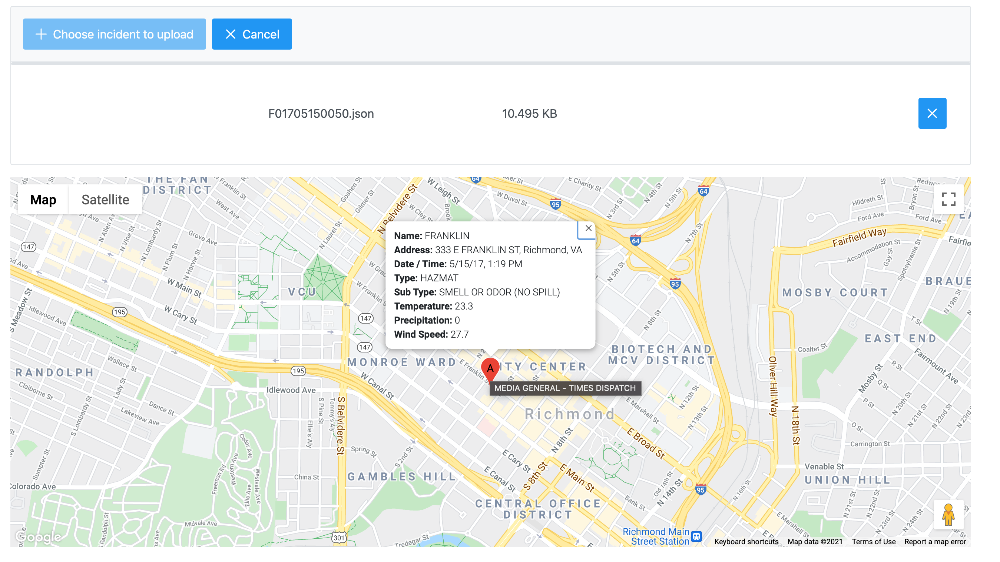

# Summary

This application is able to upload an incident JSON file and display the location of the incident and metadata including the weather at the time of the incident. I spent a total time of approximately 8 hours on this project.

## Installation

To Install this app:

- Install the latest LTS release node.js
- Install the latest Angular CLI
  ```console
  user@yourcomputer: ~$ npm install -g @angular/cli
  ```
- Clone this repo to your desired location
- Run npm install in the root of the download source
  ```console
  user@yourcomputer: ~$ npm install -g
  ```
- Run ng serve
  ```console
  user@yourcomputer: ~$ ng serve
  ```
- Navigate to http://localhost:4200 in your browser

## How to use the app

Click the "Choose incident to upload" button to upload a JSON file that contains the incident (this file needs to be in the exact format as what was supplied in the project instructions zip file). Once you see a marker on the map, the user can click the marker to view a subset of the metadata. To try a different file click the "Cancel" button at the top, and then re-upload a different file via the "Choose incident to upload" button.

## Example



## Production Build

A production build would apply API keys in a config or in environmental variables. Additionally, unit tests would be written to validate core functionality. A login page would also be added as well seperating key features into modules. I would have also forced all observables to unsubscribe when leaving the page. Technically, the http library in Angular should automatically destroy all API calls.
